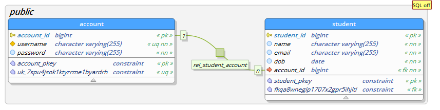

# Student Database - Spring REST API

## Overview

This project is a REST API that allows for creation of accounts and CRUD operations with Student data.

## Table of Contents

-   [Stack](#stack)<br/>
-   [Usage](#usage)<br/>
    -   [Account Commands](#account-commands)<br/>
    -   [Student Commands](#student-commands)<br/>
-   [Model](#model)<br/>
-   [Development](#development)<br/>

___

## Stack

This project was developed with Java Spring Boot and PostgreSQL.

**Spring Dependencies**

-   Spring Boot Security
-   Spring Boot Web
-   Spring Boot Data JPA
-   PostgreSQL
-   JWT
-   Thymeleaf
-   JUnit

___ 
## Usage

### Account Commands

| Method | Endpoint                | Description               |
| ------ | ----------------------- | ------------------------- |
| POST   | `/api/account/register` | Create new account        |
| POST   | `/api/account/login `   | Login to existing account |

<br>

Both require the following body `{ username, password }`, example shown below


```
{
    "username":"roynulrohan",
    "password":"Password123"
}
```

Returns the **account ID** along with **Bearer Token** which will be required for authentication

### Student Commands

**Important** - Authentication is required for the following endpoints via **Bearer Token** which can be obtained from the account commands.

| Method | Endpoint                                       | Description              |
| ------ | ---------------------------------------------- | ------------------------ |
| POST   | `/api/account/{accountID}/students `           | Add new student          |
| GET    | `/api/account/{accountID}/students `           | Get all your students    |
| GET    | `/api/account/{accountID}/students/studentID`  | Get student by ID        |
| DELETE | `/api/account/{accountID}/students/studentID`  | Delete student by ID     |
| PUT    | `/api/account/{accountID}/students/studentID`  | Replace student by ID    |
| PATCH  | `/api/account/{accountID}/students/studentID ` | Update student partially |

<br>

POST and PUT endpoints require the following body `{ name, email, dob }`, example shown below

```
{
    "name":"Roynul Rohan",
    "email":"roynulrohan@gmail.com",
    "dob":"2002-06-30"
}
```

PATCH endpoint uses only the `name`, `email` attributes. Both are _optional_.

___
## Model

_Modeled using PgModeler_

___

## Development

To run this application locally, you will need the following installed:

-   [JDK 17](https://www.oracle.com/java/technologies/javase/jdk17-archive-downloads.html)
-   [Maven 3.8.4+](https://maven.apache.org/download.cgi)
-   [PostgreSQL](https://www.postgresql.org/download/)

**Setup**

1. Create a `.env` file in the root directory (**Note**: this file will be git ignored)

```
touch .env
```

2. Open up the `.env` file and provide the following environmental variables. **Imporant**

```bash
# URL of database including the database name
# eg. jdbc:postgresql://localhost:5432/studentdatabase
SPRING_DATASOURCE_URL=jdbc:postgresql://{YOUR_DB_URL}

# database username
SPRING_DATASOURCE_USERNAME=

# database password
SPRING_DATASOURCE_PASSWORD=

# JPA Mode
# create-drop - Create, then destroy Schema at the end of session (Will erase everything)
# update - Update the Schema if necessary
# none
SPRING_JPA_DDL_MODE=

# JWT secret key
JWT_SECRET=
```

3. Export the environmental variables

```
export $(cat .env | xargs)
```

4. Open up StudentDatabaseAPI directory

```
cd .\StudentDatabaseAPI\
```

5. Now you can run the application using an IDE or by using the command below

```bash
mvn spring-boot:run
```

**To run with Docker**

1. Ensure `.env` file exists with all environmental variables within the root directory

2. Build the application using

```bash
docker-compose build
```

3. Now you can run the application using

```bash
docker-compose up
```
